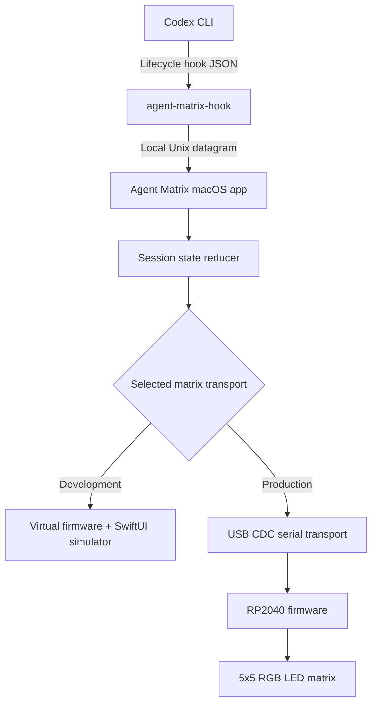
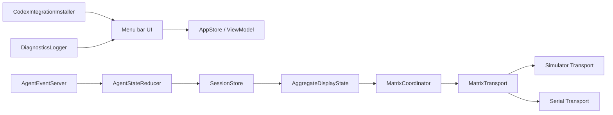

# Agent Matrix — Complete Implementation Plan

**Status:** Implementation specification
**Target platform:** macOS + Waveshare RP2040-Matrix
**Primary integration:** Codex CLI running in Terminal
**Document date:** 2026-07-17
**Working name:** Agent Matrix

---

## 1. Executive summary

Agent Matrix is a small macOS menu-bar application that detects the lifecycle state of a terminal-based coding agent and reflects that state on a Waveshare RP2040-Matrix connected directly to the Mac over USB-C.

The finished system should require:

- One macOS application.
- One bundled command-line hook helper.
- One firmware image flashed to the RP2040 board.
- One USB-C data cable.
- No Raspberry Pi.
- No network connection.
- No terminal screen scraping.
- No Accessibility or Screen Recording permission.

The intended user journey is:

1. Install and open Agent Matrix on the Mac.
2. Enable the Codex integration.
3. Review and trust the installed hooks from Codex using `/hooks`.
4. Use the built-in matrix simulator while the hardware is unavailable.
5. Flash the provided UF2 firmware when the RP2040-Matrix arrives.
6. Connect the board by USB-C.
7. Start Codex in any normal terminal.
8. Submit a prompt and see the matrix animate automatically.
9. See a different visual state when Codex needs approval or completes the turn.

The implementation is deliberately split into independent layers:



The same semantic commands must drive both the virtual matrix and the physical board. This prevents the simulator from becoming a throwaway prototype.

---

## 2. Goals

### 2.1 Product goals

The system must:

- Detect when a supported terminal agent starts working.
- Detect when the agent requests approval or user input where supported.
- Detect when the current agent turn finishes.
- Show the state clearly on a single 5×5 RGB matrix.
- Work from ordinary Terminal, iTerm2, Warp, or another terminal without scraping the terminal UI.
- Reconnect automatically after USB unplugging, reconnection, Mac sleep, and wake.
- Continue rendering animations on the RP2040 without streaming every frame from the Mac.
- Include a useful simulator so the full Mac workflow can be built before the hardware arrives.
- Support additional agent adapters later without rewriting the matrix or USB layers.

### 2.2 Engineering goals

The implementation must:

- Keep agent-specific logic separate from display logic.
- Use a versioned local event schema.
- Use a versioned USB protocol.
- Preserve existing Codex hook configuration.
- Never block or interfere with the agent when the Mac app is unavailable.
- Avoid sending prompts, tool inputs, source code, or terminal output to the display app.
- Include deterministic animation assets shared by Swift and C++.
- Be testable without physical hardware.
- Be distributable as a signed and notarized macOS app outside the Mac App Store.

---

## 3. Non-goals for the first release

The first release will not:

- Support arbitrary terminal applications by visually reading their output.
- Determine whether every silent process is “thinking” or “stuck.”
- Display readable text on the 5×5 matrix.
- Show several agents simultaneously as separate detailed dashboards.
- Stream complete RGB frames from the Mac to the board.
- Automatically trust Codex hooks on behalf of the user.
- Depend on a Raspberry Pi, Wi-Fi, Bluetooth, or a cloud service.
- Target the Mac App Store.
- Provide over-the-air firmware updates.
- Promise a reliable red “agent failed” state when the agent does not expose a dedicated failure event.

A generic process wrapper may be added later, but agent-specific lifecycle hooks are the reliable source of truth for the first release.

---

## 4. Verified hardware assumptions

The Waveshare RP2040-Matrix provides:

- Raspberry Pi RP2040 microcontroller.
- 264 KB SRAM.
- 2 MB onboard flash.
- A 5×5 RGB NeoPixel-style LED matrix.
- USB device support.
- USB mass-storage drag-and-drop programming.
- A USB-C connector.
- BOOT and reset controls.
- RGB matrix data on GPIO 16.

The board can draw approximately 350 mA when the matrix is fully illuminated. The application must therefore use restrained brightness and avoid full-power white across all 25 LEDs for extended periods.

### 4.1 Hardware policy

Use the following defaults:

- Maximum logical brightness: `64 / 255`.
- Default brightness: `32 / 255`.
- No animation may illuminate all 25 LEDs at full white.
- Frame rate: 30 FPS maximum.
- Idle state should use one to five dim pixels.
- The physical orientation must be configurable in firmware until verified on the real board.

### 4.2 Required purchase checklist

- Waveshare RP2040-Matrix.
- USB-C data cable compatible with the Mac.
- USB-C to USB-A adapter only if required by the Mac or cable.
- No separate Raspberry Pi or power adapter is required for normal low-brightness use.

---

## 5. User-visible state model

The display has seven states:

| Internal state | Matrix treatment | Meaning |
|---|---|---|
| `booting` | White dot expands from center | Firmware is starting |
| `disconnected` | Very dim white center dot | Board is powered but no Mac heartbeat is present |
| `idle` | Slow breathing cyan center dot | App and board are connected; no active turn |
| `working` | Blue columns fill left to right, then clear left to right | Agent is processing or using tools |
| `needsInput` | Pulsing amber exclamation or pause glyph | Approval or user input is required |
| `finished` | Green checkmark, then fade | Agent turn completed |
| `error` | Red X with restrained pulse | Integration, transport, or explicitly detected agent error |

### 5.1 State timing defaults

```text
Mac heartbeat interval:       2 seconds
Firmware heartbeat timeout:  8 seconds
Finished display duration:   10 seconds
Error display duration:      Until next turn or manual clear
Working animation step:      180 milliseconds per column
Render loop:                 30 frames per second
```

### 5.2 State priority across multiple sessions

A single matrix displays one aggregate state. When multiple agent sessions exist, use this priority:

```text
error
  > needsInput
  > working
  > finished
  > idle
```

Rules:

1. Any current `needsInput` session takes precedence over all working sessions.
2. A working session takes precedence over a recently finished session.
3. `finished` is shown only when no session still needs input or is working.
4. An integration or transport error should not erase active session data; it is a display-level priority.
5. After the finished duration expires, the aggregate state becomes idle.
6. A new prompt immediately clears finished and error presentation states.

---

## 6. Primary agent integration: Codex CLI

Codex supports lifecycle command hooks loaded from user or project configuration. User-level hooks can live in:

```text
~/.codex/hooks.json
```

Hooks must be reviewed and trusted by the user before Codex runs them. Agent Matrix must instruct the user to open:

```text
/hooks
```

inside Codex after installation or any material hook-definition change.

### 6.1 Codex events used by Agent Matrix

| Codex hook event | Normalized event | Display result |
|---|---|---|
| `SessionStart` | `sessionStarted` | Usually idle |
| `UserPromptSubmit` | `turnStarted` | Working |
| `PreToolUse` | `activity` | Working |
| `PostToolUse` | `activity` | Working |
| `PermissionRequest` | `approvalRequired` | Needs input |
| `SubagentStart` | `activity` | Working |
| `SubagentStop` | `activity` | Working |
| `Stop` | `turnFinished` | Finished |

### 6.2 Important Codex limitations

The implementation must document these limitations honestly:

- `PermissionRequest` indicates that Codex is about to ask for approval.
- There may not be a distinct hook immediately after the user approves. The display can remain amber until the next lifecycle event, usually a tool completion or stop event.
- `PostToolUse` does not cover every possible internal tool path.
- `Stop` represents completion of the turn and is the main reliable finished signal.
- The current hook set does not provide a universal dedicated “turn failed” event.
- The transcript path is not a stable hook interface and must not be parsed.
- Hooks can run concurrently, so events may arrive very close together or, occasionally, slightly out of order.

### 6.3 Codex hook configuration

The app installs handlers into `~/.codex/hooks.json`. The actual executable path must be absolute and safely quoted.

Example structure:

```json
{
  "hooks": {
    "SessionStart": [
      {
        "hooks": [
          {
            "type": "command",
            "command": "\"/Users/USER/Library/Application Support/AgentMatrix/bin/agent-matrix-hook\" codex",
            "timeout": 2
          }
        ]
      }
    ],
    "UserPromptSubmit": [
      {
        "hooks": [
          {
            "type": "command",
            "command": "\"/Users/USER/Library/Application Support/AgentMatrix/bin/agent-matrix-hook\" codex",
            "timeout": 2
          }
        ]
      }
    ],
    "PreToolUse": [
      {
        "matcher": "*",
        "hooks": [
          {
            "type": "command",
            "command": "\"/Users/USER/Library/Application Support/AgentMatrix/bin/agent-matrix-hook\" codex",
            "timeout": 2
          }
        ]
      }
    ],
    "PermissionRequest": [
      {
        "matcher": "*",
        "hooks": [
          {
            "type": "command",
            "command": "\"/Users/USER/Library/Application Support/AgentMatrix/bin/agent-matrix-hook\" codex",
            "timeout": 2
          }
        ]
      }
    ],
    "PostToolUse": [
      {
        "matcher": "*",
        "hooks": [
          {
            "type": "command",
            "command": "\"/Users/USER/Library/Application Support/AgentMatrix/bin/agent-matrix-hook\" codex",
            "timeout": 2
          }
        ]
      }
    ],
    "SubagentStart": [
      {
        "hooks": [
          {
            "type": "command",
            "command": "\"/Users/USER/Library/Application Support/AgentMatrix/bin/agent-matrix-hook\" codex",
            "timeout": 2
          }
        ]
      }
    ],
    "SubagentStop": [
      {
        "hooks": [
          {
            "type": "command",
            "command": "\"/Users/USER/Library/Application Support/AgentMatrix/bin/agent-matrix-hook\" codex",
            "timeout": 2
          }
        ]
      }
    ],
    "Stop": [
      {
        "hooks": [
          {
            "type": "command",
            "command": "\"/Users/USER/Library/Application Support/AgentMatrix/bin/agent-matrix-hook\" codex",
            "timeout": 2
          }
        ]
      }
    ]
  }
}
```

### 6.4 Safe configuration installation

The integration installer must:

1. Resolve the user home directory through system APIs.
2. Create `~/.codex/` only if necessary.
3. Read and parse the existing `hooks.json`.
4. Refuse to overwrite malformed JSON.
5. Create a timestamped backup before modifying an existing file.
6. Preserve all unrelated events, matcher groups, and handlers.
7. Add only missing Agent Matrix handlers.
8. Avoid duplicating entries when “Install” is pressed again.
9. Write to a temporary file in the same directory.
10. Set user-only file permissions where appropriate.
11. Atomically rename the temporary file over the destination.
12. Verify the resulting JSON by reading and parsing it again.
13. Show that Codex trust review is still required.
14. On uninstall, remove only handlers whose normalized command points to the Agent Matrix helper.
15. Leave unrelated empty or non-empty structures untouched.

Do not attempt to edit Codex trust storage. Trust remains a deliberate Codex user action.

---

## 7. Hook helper executable

The Xcode workspace contains a second executable target:

```text
agent-matrix-hook
```

The macOS application copies this signed helper to:

```text
~/Library/Application Support/AgentMatrix/bin/agent-matrix-hook
```

The stable installed path prevents hook configuration from depending on the location of the `.app` bundle.

### 7.1 Helper responsibilities

The helper must:

1. Read one JSON object from standard input.
2. Parse only the fields needed for state detection.
3. Discard prompt text, tool input, tool output, transcript content, and source code.
4. Add an event timestamp and helper schema version.
5. Send one compact normalized message to the local Agent Matrix socket.
6. Exit quickly.
7. Exit successfully when the Mac app is not running.
8. Never delay or block the agent because the display is unavailable.
9. Write no human-readable text to standard output.
10. Handle the `Stop` hook’s output contract correctly.

### 7.2 Privacy-minimal normalized event

```json
{
  "v": 1,
  "source": "codex",
  "event": "PermissionRequest",
  "sessionId": "session-123",
  "turnId": "turn-456",
  "cwd": "/Users/bart/project",
  "toolName": "Bash",
  "sentAtUnixMs": 1784284200123,
  "eventInstanceId": "C1E156A4-4AD4-49B7-A3DB-BE7287415AA0"
}
```

Fields:

| Field | Required | Notes |
|---|---:|---|
| `v` | Yes | Local schema version |
| `source` | Yes | `codex`, later `claude`, `generic`, etc. |
| `event` | Yes | Original lifecycle name or normalized name |
| `sessionId` | Yes | Used for multi-session tracking |
| `turnId` | No | Present for turn-scoped events |
| `cwd` | No | Used only for a human-readable project label |
| `toolName` | No | Diagnostic metadata only |
| `sentAtUnixMs` | Yes | Used for ordering and stale-event rejection |
| `eventInstanceId` | Yes | Used for deduplication |

### 7.3 Input limits

The helper should:

- Accept a maximum input size, initially 2 MB.
- Fail closed on malformed JSON by sending a small `integrationError` event when possible.
- Never include the raw malformed input in logs.
- Truncate `cwd` to a safe maximum length.
- Use strict decoding for known scalar fields and ignore unknown fields.

### 7.4 Output behavior

Most hooks should receive no standard output from the helper.

For events that require JSON output on successful exit, especially `Stop`, output:

```json
{}
```

The helper must never accidentally print debug logging to stdout or stderr. Debug logging is written to a rotating file only when diagnostics are enabled.

---

## 8. Local IPC between helper and Mac app

Use a Unix domain datagram socket rather than HTTP.

Recommended path:

```text
/tmp/agent-matrix-<uid>.sock
```

Example:

```text
/tmp/agent-matrix-501.sock
```

### 8.1 Why Unix datagrams

- Local-only communication.
- No network port.
- No firewall prompt.
- One packet equals one event.
- The helper does not need a long-lived connection.
- Sending fails immediately when the app is closed.
- Small implementation surface.
- No request/response contract is needed for normal hook events.

### 8.2 Socket security

The app must:

- Create the socket as the current user.
- Set mode `0600`.
- Refuse to use a socket owned by another user.
- Remove a stale socket only when it is owned by the current user.
- Limit packet size, initially 4 KB.
- Validate JSON before passing data to the reducer.
- Never execute values received through the socket.
- Regenerate the socket on app launch.

### 8.3 App lifecycle

On app startup:

1. Check for an existing socket path.
2. Verify ownership.
3. Remove a stale user-owned socket.
4. Bind a new datagram socket.
5. Apply mode `0600`.
6. Begin receiving.
7. Start the matrix transport.
8. Set aggregate agent state to idle.
9. Send the initial state to the simulator or board.

On app shutdown:

1. Send `idle` if possible.
2. Close the display transport.
3. Close the IPC socket.
4. Remove the socket file.

---

## 9. macOS application architecture

### 9.1 Technology decisions

- Language: Swift.
- UI: SwiftUI.
- Menu-bar integration: SwiftUI `MenuBarExtra`, with AppKit fallback only where needed.
- Concurrency: Swift Concurrency and actors.
- Minimum macOS version: macOS 13, primarily to use `SMAppService`.
- Launch at login: `SMAppService.mainApp`.
- Distribution: Developer ID signing and notarized DMG.
- App Sandbox: disabled for the initial direct-distribution release.
- Serial library: ORSSerialPort behind an internal abstraction for version one.
- Local persistence: `UserDefaults` for preferences; small rotating text/JSON logs for diagnostics.
- No database required.

### 9.2 High-level module graph



### 9.3 Xcode workspace targets

```text
AgentMatrix.xcworkspace
├── AgentMatrixApp              macOS menu-bar application
├── AgentMatrixHook             command-line executable
├── AgentMatrixCore             reusable Swift package/library
├── AgentMatrixSimulator        simulator UI and virtual firmware
├── AgentMatrixProtocol         event and USB protocol types
├── AgentMatrixTests            unit tests
└── AgentMatrixIntegrationTests integration and pseudo-device tests
```

### 9.4 Core Swift types

```swift
enum AgentSource: String, Codable, Sendable {
    case codex
    case claude
    case generic
}

enum AgentLifecycleEvent: String, Codable, Sendable {
    case sessionStarted
    case turnStarted
    case activity
    case approvalRequired
    case turnFinished
    case turnFailed
    case sessionEnded
    case integrationError
}

enum AgentSessionState: String, Codable, Sendable {
    case idle
    case working
    case needsInput
    case finished
    case failed
}

enum DisplayState: String, Codable, Sendable {
    case booting
    case disconnected
    case idle
    case working
    case needsInput
    case finished
    case error
}
```

### 9.5 Session model

```swift
struct AgentSession: Identifiable, Sendable {
    let id: String
    let source: AgentSource
    var currentTurnID: String?
    var workingDirectory: String?
    var state: AgentSessionState
    var lastEventAt: Date
    var finishedAt: Date?
    var lastEventInstanceID: UUID?
}
```

### 9.6 State reducer rules

The reducer runs inside an actor.

Core transitions:

```text
sessionStarted:
    create/update session
    state = idle unless a current turn already exists

turnStarted:
    currentTurnID = incoming turn
    state = working
    clear finishedAt

activity:
    ignore if event timestamp predates a known stop for the same turn
    state = working
    refresh lastEventAt

approvalRequired:
    state = needsInput
    refresh lastEventAt

turnFinished:
    state = finished
    finishedAt = now

turnFailed:
    state = failed
    finishedAt = now

sessionEnded:
    remove or idle session

integrationError:
    set display-level error without corrupting session state
```

Out-of-order protection:

- Store the last accepted timestamp per session and turn.
- Store the timestamp of the last terminal event, such as `turnFinished`.
- Reject a `working` or `activity` event for a turn when its timestamp is earlier than that turn’s accepted stop.
- Deduplicate by `eventInstanceId`.
- Treat a new `turnStarted` with a different turn ID as authoritative even if a prior turn was finished recently.

### 9.7 Session cleanup

- Finished sessions remain in memory for the configured finished display duration.
- Idle sessions can remain for diagnostics.
- Sessions with no events for a long safety window can be marked unknown or removed.
- Do not use a short stale timeout to declare a long-running agent dead.
- On app restart, default to idle rather than falsely restoring an old working state.
- The next real lifecycle event restores the correct state.
- When only the USB device reconnects and the app remains alive, resend the current aggregate state immediately.

---

## 10. Menu-bar user experience

### 10.1 Status item

The status item should indicate:

- Matrix disconnected.
- Simulator active.
- Physical board connected.
- Agent working.
- Agent needs input.
- Integration error.

The icon should remain simple and monochrome to fit macOS conventions.

### 10.2 Popover layout

```text
Agent Matrix

Display
● RP2040-Matrix connected
State: Working
Brightness: 32%

Agent
Codex
Project: agent-matrix
Last event: PreToolUse · 1s ago

[ Open Matrix Simulator ]
[ Test Display ]
[ Settings… ]
```

### 10.3 Settings

#### General

- Launch at login.
- Finished-state duration.
- Show simulator automatically in development mode.
- Enable diagnostic logging.
- Clear current display state.

#### Display

- Target: Automatic / Hardware / Simulator.
- Brightness.
- Matrix rotation: 0° / 90° / 180° / 270°.
- Mirror horizontally.
- Test every state.
- Identify connected device.

#### Integrations

- Codex: Not installed / Installed / Needs trust review / Healthy.
- Install hooks.
- Reinstall hooks.
- Remove hooks.
- Open setup instructions.
- Show last received Codex event.

#### Developer

- Simulate unplug.
- Drop next acknowledgement.
- Delay device response.
- Send malformed response.
- Force heartbeat timeout.
- Reset virtual firmware.
- Export diagnostics.

### 10.4 First-run onboarding

Screen sequence:

1. **Purpose**
   Explain that Agent Matrix shows terminal-agent status on a physical or simulated 5×5 display.

2. **Use the simulator now**
   Open the simulator before requiring hardware.

3. **Install Codex integration**
   Explain exactly which file is modified.

4. **Trust hooks in Codex**
   Tell the user to run `/hooks`, review the Agent Matrix command, and trust it.

5. **Run a test prompt**
   The simulator should change to working.

6. **Connect hardware later**
   Provide UF2 flashing steps and automatic hardware detection.

---

## 11. Matrix transport abstraction

The app must not couple state management to serial APIs.

```swift
protocol MatrixTransport: Sendable {
    var events: AsyncStream<MatrixTransportEvent> { get }

    func connect() async
    func disconnect() async
    func send(_ command: MatrixCommand) async throws
}
```

Implementations:

```swift
final actor SimulatorMatrixTransport: MatrixTransport
final actor SerialMatrixTransport: MatrixTransport
final actor RecordingMatrixTransport: MatrixTransport
```

### 11.1 Transport events

```swift
enum MatrixTransportEvent: Sendable {
    case searching
    case connected(DeviceIdentity)
    case disconnected
    case response(MatrixResponse)
    case recoverableError(String)
    case fatalError(String)
}
```

### 11.2 Matrix coordinator

`MatrixCoordinator` owns:

- Current aggregate display state.
- Heartbeat timer.
- Command sequence number.
- Brightness.
- Selected transport.
- Reconnection policy.
- State resend after reconnect.
- Finished-state timer.

It should never require the reducer to know whether the output is virtual or physical.

---

## 12. Built-in simulator

The simulator is a first-class product feature, not a temporary mock.

### 12.1 Simulator window

The simulator window contains:

- A scaled 5×5 pixel matrix.
- Current semantic state.
- Current firmware animation frame.
- Current brightness.
- Last host command.
- Last virtual-device response.
- Heartbeat age.
- Connection state.
- Firmware version.
- Fault-injection controls.

### 12.2 Rendering

Use a SwiftUI `Canvas` or a fixed grid.

Recommended rendering behavior:

- Circular pixels.
- Small spacing matching the physical board.
- Black background.
- Optional subtle bloom.
- Pixel colors derived from the same generated animation assets as firmware.
- `TimelineView` or a controlled animation clock.
- Deterministic frame selection based on elapsed time.

Do not rely on implicit SwiftUI animations for protocol behavior. The simulator must render explicit frames so tests can assert exact output.

### 12.3 Virtual firmware

Implement the virtual device as an actor:

```swift
actor VirtualFirmware {
    private var state: DisplayState = .booting
    private var brightness: UInt8 = 32
    private var lastHeartbeatAt: ContinuousClock.Instant?
    private var lastSequence: UInt32 = 0

    func receive(_ command: MatrixCommand) -> MatrixResponse
    func frame(at instant: ContinuousClock.Instant) -> MatrixFrame
    func tick(at instant: ContinuousClock.Instant)
    func reset()
}
```

It must reproduce:

- `HELLO` handshake.
- Protocol version checks.
- State commands.
- Brightness commands.
- Acknowledgements.
- Invalid-command errors.
- Sequence handling.
- Host heartbeat timeout.
- Boot and disconnected behavior.
- Firmware version response.
- Animation frame selection.

### 12.4 Simulator fault injection

Required faults:

- Device unplug.
- Device reconnect.
- Drop one ACK.
- Delay all responses.
- Return wrong protocol version.
- Return malformed response.
- Freeze firmware.
- Expire heartbeat.
- Reset during working state.

These controls make recovery behavior reproducible before the hardware arrives.

---

## 13. Optional pseudo-serial simulator

After the in-app simulator is working, add a pseudo-terminal test device.

Purpose:

- Exercise the real serial transport.
- Verify framing across fragmented reads.
- Test multiple lines in one read.
- Test port closure and reconnection.
- Test handshake timeouts.
- Test malformed serial responses.

Architecture:

```text
SerialMatrixTransport
        ↓
pseudo-terminal slave path
        ↓
Virtual RP2040 process
        ↓
VirtualFirmware core
        ↓
Simulator window or test assertions
```

Implementation options:

- Internal test helper using `openpty()`.
- Development-only use of `socat`.
- A dedicated `AgentMatrixVirtualDevice` command-line target.

The in-app simulator remains the primary development experience. The pseudo-device exists to validate the serial boundary.

---

## 14. USB serial protocol

Use newline-delimited ASCII. It is easy to inspect in a terminal and simple to implement without dynamic allocation.

### 14.1 Protocol version

```text
AM1
```

`AM` means Agent Matrix, and `1` is the major protocol version.

### 14.2 Host commands

```text
AM1 HELLO
AM1 STATE <seq> <state> <ttl_ms>
AM1 PING <seq>
AM1 BRIGHTNESS <seq> <value>
AM1 IDENTIFY <seq>
AM1 RESET_STATE <seq>
```

Examples:

```text
AM1 HELLO
AM1 STATE 41 WORKING 8000
AM1 STATE 42 NEEDS_INPUT 8000
AM1 STATE 43 FINISHED 8000
AM1 PING 44
AM1 BRIGHTNESS 45 32
AM1 IDENTIFY 46
```

### 14.3 Device responses

```text
AM1 READY <firmware_version> <hardware_id>
AM1 ACK <seq>
AM1 ERR <seq_or_0> <error_code>
AM1 STATUS <state> <brightness>
```

Examples:

```text
AM1 READY 1.0.0 waveshare-rp2040-matrix
AM1 ACK 41
AM1 ERR 42 UNKNOWN_STATE
AM1 STATUS WORKING 32
```

### 14.4 Valid wire states

```text
BOOTING
DISCONNECTED
IDLE
WORKING
NEEDS_INPUT
FINISHED
ERROR
```

### 14.5 Framing rules

- UTF-8 / ASCII-compatible bytes.
- One command per line.
- Accept `\n` and `\r\n`.
- Maximum line length: 128 bytes.
- Ignore blank lines.
- Reject lines with the wrong protocol prefix.
- Reject unknown commands and states.
- Parse numeric values with overflow checks.
- Do not allocate memory based on incoming lengths.
- Firmware maintains a fixed line buffer.
- Host must wait for `READY` before treating a port as the device.

### 14.6 Sequence rules

- Sequence is an unsigned 32-bit integer.
- Sequence zero is reserved for unsequenced protocol errors.
- Host increments sequence for every command except `HELLO`.
- Device ACKs every valid sequenced command.
- Duplicate sequence commands may be ACKed without replaying one-shot behavior.
- Sequence wraparound is accepted.

### 14.7 Heartbeat rules

- Every `STATE` refreshes the host heartbeat TTL.
- `PING` refreshes the heartbeat using the current TTL.
- The host sends `PING` every two seconds.
- If the TTL expires, firmware changes to `DISCONNECTED`.
- Firmware animation continues independently between commands.
- On reconnect, the Mac immediately sends brightness and the current state.

### 14.8 Why semantic commands are used

The Mac sends:

```text
WORKING
```

rather than 25 RGB values for every frame.

Benefits:

- Smooth animation when the Mac is busy.
- Low USB traffic.
- Stable behavior through brief scheduling delays.
- Firmware remains useful with another host.
- Animations can be revised without changing the agent adapters.
- Protocol tests are simple.

---

## 15. Physical serial transport

### 15.1 Discovery

Do not store a permanent path such as:

```text
/dev/cu.usbmodem1101
```

The path may change.

Discovery sequence:

1. Observe available serial ports.
2. Filter likely callout ports, primarily `/dev/cu.usbmodem*`.
3. Open one candidate at a time.
4. Configure conventional `115200 8N1`.
5. Send `AM1 HELLO`.
6. Wait for a valid `AM1 READY` response.
7. Select only a device that identifies as Agent Matrix.
8. Close all nonmatching ports.
9. Publish a connected event.

The baud rate has little practical meaning for USB CDC, but 115200 is a conventional explicit setting.

### 15.2 Connection behavior

- Initial handshake timeout: 500 ms.
- Handshake retry per candidate: one retry.
- Reconnect delays: 0.5 s, 1 s, 2 s, then 5 s maximum.
- Reset retry delay after Mac wake.
- Cancel old read loops before opening a replacement port.
- Serialize writes through one actor.
- Parse incoming data incrementally.
- Handle partial lines and multiple lines per read.
- Consider the device connected only after a successful handshake.

### 15.3 Hotplug and sleep

The transport must handle:

- App starts before board is connected.
- Board is connected before app starts.
- Board is unplugged while working.
- Board is reconnected while working.
- Mac sleeps while connected.
- Mac wakes with the same or a new device path.
- Firmware resets while the port remains present.

On any successful reconnection:

1. Handshake.
2. Send brightness.
3. Send current aggregate state.
4. Restart heartbeats.
5. Update the menu-bar status.

---

## 16. RP2040 firmware architecture

### 16.1 Technology

Use:

- Raspberry Pi Pico C/C++ SDK.
- C++ with no exceptions and no runtime dynamic allocation in the main loop.
- TinyUSB CDC device support.
- PIO-driven WS2812 output.
- CMake.
- UF2 output.
- GPIO 16 for matrix data.

A Zephyr implementation is also viable because the board has upstream board support, but the initial plan selects Pico SDK to keep the firmware small and direct.

### 16.2 Firmware directory

```text
firmware/
├── CMakeLists.txt
├── pico_sdk_import.cmake
├── include/
│   ├── agent_matrix_protocol.h
│   ├── animations.h
│   ├── display_state.h
│   ├── matrix_driver.h
│   └── version.h
├── src/
│   ├── main.cpp
│   ├── agent_matrix_protocol.cpp
│   ├── animations.cpp
│   ├── display_state.cpp
│   ├── matrix_driver.cpp
│   └── usb_cdc.cpp
├── generated/
│   └── generated_animations.h
└── tests/
    ├── protocol_parser_tests.cpp
    └── animation_tests.cpp
```

### 16.3 Firmware loop

```text
Initialize clocks and watchdog
Initialize USB CDC
Initialize WS2812 PIO on GPIO16
Show boot animation
Enter disconnected state

Loop:
    service TinyUSB
    read available CDC bytes
    assemble complete lines
    parse and apply commands
    send responses
    evaluate heartbeat timeout
    calculate current animation frame
    write 25 pixels when frame changes
    feed watchdog
```

### 16.4 Firmware safety rules

- Fixed 128-byte input line buffer.
- No unbounded string operations.
- No heap allocation in the render loop.
- Clamp brightness to firmware maximum.
- Gamma-correct RGB values.
- Never block waiting for USB.
- Continue animation when no USB bytes arrive.
- Enable watchdog recovery from a stalled loop.
- Start in `DISCONNECTED`, never in `WORKING`.
- Ignore malformed commands after returning an error.
- Do not persist old working state across power loss.

### 16.5 Orientation and pixel mapping

The physical matrix may use serpentine ordering and an orientation that differs from the simulator.

Represent logical coordinates separately from physical indices:

```cpp
uint8_t physicalIndex(uint8_t x, uint8_t y);
```

Support compile-time or command-configurable:

- Rotation 0°.
- Rotation 90°.
- Rotation 180°.
- Rotation 270°.
- Horizontal mirror.
- Serpentine row mapping.

The initial firmware should include a diagnostic animation that lights pixels in index order. This makes physical mapping easy to verify when the board arrives.

---

## 17. Shared animation specification

To keep Swift and firmware visually aligned, define animations once.

```text
shared/
├── animations.json
├── protocol-fixtures.json
└── generate/
    └── generate-assets.ts
```

### 17.1 Animation JSON example

```json
{
  "version": 1,
  "brightnessLimit": 64,
  "states": {
    "finished": {
      "fps": 1,
      "loop": false,
      "frames": [
        {
          "durationMs": 900,
          "pixels": [
            "00000",
            "0000G",
            "G00G0",
            "0GG00",
            "00000"
          ]
        }
      ]
    },
    "error": {
      "fps": 4,
      "loop": true,
      "frames": [
        {
          "durationMs": 250,
          "pixels": [
            "R000R",
            "0R0R0",
            "00R00",
            "0R0R0",
            "R000R"
          ]
        }
      ]
    }
  },
  "palette": {
    "0": [0, 0, 0],
    "R": [255, 0, 0],
    "G": [0, 255, 80],
    "B": [0, 120, 255],
    "C": [0, 220, 255],
    "A": [255, 120, 0],
    "W": [255, 255, 255]
  }
}
```

### 17.2 Generated outputs

The generator creates:

```text
mac/AgentMatrixProtocol/Sources/GeneratedAnimations.swift
firmware/generated/generated_animations.h
tests/generated/animation-fixtures.json
```

Generated files include:

- RGB values.
- Frame durations.
- Frame pixel arrays.
- State names.
- Animation loop behavior.
- Brightness constraints.

### 17.3 Animation tests

Assert:

- Every frame contains exactly 25 pixels.
- Every palette symbol is known.
- No raw RGB channel exceeds 255.
- Brightness limits are respected.
- Required states all exist.
- Swift and C++ generated checksums match.
- Static snapshots match approved fixtures.

---

## 18. Repository structure

```text
AgentMatrix/
├── README.md
├── LICENSE
├── docs/
│   ├── implementation-plan.md
│   ├── architecture.md
│   ├── protocol.md
│   ├── animations.md
│   ├── codex-integration.md
│   ├── privacy.md
│   └── troubleshooting.md
├── mac/
│   ├── AgentMatrix.xcworkspace
│   ├── AgentMatrixApp/
│   ├── AgentMatrixHook/
│   ├── AgentMatrixCore/
│   ├── AgentMatrixProtocol/
│   ├── AgentMatrixSimulator/
│   ├── AgentMatrixTests/
│   └── AgentMatrixIntegrationTests/
├── firmware/
│   ├── CMakeLists.txt
│   ├── include/
│   ├── src/
│   ├── generated/
│   └── tests/
├── shared/
│   ├── animations.json
│   ├── protocol-fixtures.json
│   └── generate/
├── wokwi/
│   ├── diagram.json
│   ├── wokwi.toml
│   └── README.md
├── scripts/
│   ├── bootstrap.sh
│   ├── generate-assets.sh
│   ├── build-mac.sh
│   ├── build-firmware.sh
│   ├── package-dmg.sh
│   └── verify-release.sh
└── .github/
    └── workflows/
        ├── mac-tests.yml
        ├── firmware-tests.yml
        └── release.yml
```

---

## 19. Implementation phases

No physical hardware is required until the hardware-validation phase.

### Phase 0 — Repository and contracts

#### Tasks

- Create repository structure.
- Add architecture decision records.
- Define normalized agent event schema.
- Define USB protocol grammar.
- Define `MatrixTransport`.
- Define display and session states.
- Add protocol fixtures.
- Add animation source JSON and generator.
- Configure Swift formatting/linting.
- Configure C/C++ formatting.
- Add CI skeleton.

#### Exit criteria

- Swift protocol models compile.
- C++ protocol enums compile.
- Shared fixtures are generated deterministically.
- Architecture and protocol decisions are documented.

---

### Phase 1 — Matrix design sandbox

#### Tasks

- Build the SwiftUI 5×5 matrix component.
- Implement explicit frame rendering.
- Implement the animation clock.
- Create all seven state animations.
- Add brightness control.
- Add rotation and mirroring.
- Add manual state buttons.
- Add snapshot tests.

#### Exit criteria

- Every state can be previewed.
- Animations are visually distinct without relying only on color.
- Generated frames render identically in repeated tests.
- The simulator works without any agent or firmware code.

---

### Phase 2 — Virtual firmware and simulator transport

#### Tasks

- Implement `VirtualFirmware`.
- Implement protocol parser and serializer in Swift.
- Implement handshake.
- Implement sequence ACKs.
- Implement heartbeat timeout.
- Implement simulated disconnect/reconnect.
- Add fault injection.
- Add simulator diagnostics panel.
- Implement `SimulatorMatrixTransport`.
- Implement `RecordingMatrixTransport` for tests.

#### Exit criteria

- The app sends real protocol commands to virtual firmware.
- The virtual device independently enters disconnected after heartbeat loss.
- Invalid commands generate expected errors.
- The simulator can reproduce unplug, reset, and delayed ACK behavior.

---

### Phase 3 — macOS app shell

#### Tasks

- Build menu-bar application.
- Build popover.
- Build settings window.
- Add transport selection.
- Add launch-at-login using `SMAppService`.
- Add structured diagnostic logging.
- Add simulator launch action.
- Add display test action.
- Add app-state persistence for preferences.
- Add error presentation.

#### Exit criteria

- The menu-bar app can start at login.
- Simulator is selectable as the active display.
- Manual test states flow through `MatrixCoordinator`, not directly into the view.
- Diagnostics show commands, responses, and state transitions.

---

### Phase 4 — Hook helper and local event server

#### Tasks

- Build `agent-matrix-hook`.
- Implement strict Codex input parsing.
- Remove prompt and tool payloads from normalized output.
- Implement Unix datagram sender.
- Implement user-owned Unix socket server in the app.
- Add event deduplication.
- Add malformed-event handling.
- Add tests with recorded Codex hook fixtures.
- Add helper installation and version checking.

#### Exit criteria

- Running the helper manually changes the simulator.
- The helper exits successfully when the app is closed.
- No prompt or tool content reaches the app.
- The helper meets the required stdout behavior for every configured event.
- Event delivery does not delay the calling process noticeably.

---

### Phase 5 — Codex integration installer

#### Tasks

- Detect `~/.codex`.
- Read existing `hooks.json`.
- Merge Agent Matrix handlers.
- Create backups.
- Write atomically.
- Validate after writing.
- Detect installed state.
- Detect whether the helper path is stale.
- Implement safe uninstall.
- Add setup UI.
- Add `/hooks` trust instructions.
- Add health check based on last received event.
- Test with empty, missing, complex, and malformed hook files.

#### Exit criteria

- Existing hooks remain unchanged.
- Reinstall does not duplicate entries.
- Uninstall removes only Agent Matrix handlers.
- Malformed user configuration is never overwritten.
- A real Codex prompt changes the simulator to working.
- A permission request changes it to needs input.
- Stop changes it to finished.

At the end of this phase, the complete user experience works without hardware.

---

### Phase 6 — Firmware core

#### Tasks

- Set up Pico SDK.
- Add TinyUSB CDC.
- Add PIO WS2812 driver on GPIO 16.
- Implement protocol parser.
- Implement display state machine.
- Implement heartbeat timeout.
- Integrate generated animations.
- Add brightness clamp and gamma correction.
- Add watchdog.
- Add diagnostic index-order animation.
- Produce UF2 artifact.

#### Exit criteria

- Firmware builds reproducibly.
- Protocol parser passes host-generated fixtures.
- Wokwi or host tests confirm state transitions and LED output.
- UF2 is generated by the build pipeline.

---

### Phase 7 — Pseudo-serial integration

#### Tasks

- Create virtual serial device target.
- Connect `SerialMatrixTransport` to a PTY.
- Test fragmented input.
- Test combined input.
- Test disconnect during write.
- Test wrong handshake.
- Test delayed and missing ACK.
- Test reconnect backoff.
- Test Mac app transport switching.

#### Exit criteria

- The real serial transport passes integration tests without the physical board.
- Reconnect behavior is deterministic.
- The app never selects a non-Agent Matrix serial device.

---

### Phase 8 — Physical hardware validation

#### Tasks

- Flash UF2 using BOOT/reset and USB mass storage.
- Verify the board appears as USB CDC.
- Verify handshake.
- Verify GPIO 16 output.
- Run index-order animation.
- Correct serpentine mapping.
- Correct rotation/mirroring defaults.
- Tune brightness.
- Test every animation.
- Test unplug/replug.
- Test sleep/wake.
- Test direct connection and common USB hubs.
- Run a long-duration animation and heartbeat soak test.
- Verify thermal behavior at the configured brightness limit.

#### Exit criteria

- Connecting the board requires no manual serial selection.
- All logical pixels map correctly.
- The board remains stable through sleep, wake, and reconnect.
- Normal animations do not create uncomfortable heat.
- Codex events drive the physical display end to end.

---

### Phase 9 — Packaging and release

#### Tasks

- Bundle or install the helper.
- Bundle the UF2.
- Add firmware flashing instructions.
- Add integration removal.
- Sign app and helper.
- Notarize application.
- Create DMG.
- Add privacy explanation.
- Add troubleshooting.
- Add release verification script.
- Test on a clean macOS user account.
- Test update over an older app version.

#### Exit criteria

- A new user can install the app without a development environment.
- The app passes Gatekeeper.
- Hook installation and removal work.
- Simulator works immediately.
- Hardware setup works using the bundled UF2.
- No unrelated Codex configuration is changed.

---

## 20. Test plan

### 20.1 Swift unit tests

Test:

- Codex event decoding.
- Unknown-field tolerance.
- Input-size limit.
- Prompt/tool-data removal.
- Event normalization.
- Session creation.
- State transitions.
- Multiple-session priority.
- Finished timeout.
- Event deduplication.
- Out-of-order event rejection.
- Display-state aggregation.
- Protocol encoding.
- Protocol response parsing.
- Hook configuration merge.
- Hook configuration uninstall.
- Atomic-write rollback behavior.
- Simulator heartbeat timeout.

### 20.2 Firmware unit tests

Where possible, compile parser and animation logic for the host.

Test:

- Valid commands.
- Invalid prefixes.
- Unknown commands.
- Unknown states.
- Missing fields.
- Numeric overflow.
- Overlong lines.
- CRLF and LF.
- Duplicate sequence.
- Sequence wraparound.
- Heartbeat timeout.
- Brightness clamp.
- Frame lookup.
- Orientation transforms.
- Animation checksums.

### 20.3 Integration tests

Test:

- App starts with no board.
- Simulator starts connected.
- Helper sends event while app is running.
- Helper sends event while app is closed.
- Several concurrent hook events.
- Two Codex sessions.
- Needs-input priority.
- Working priority.
- Finished timeout.
- PTY device connects.
- PTY device sends partial response.
- PTY device disconnects.
- Wrong serial device answers.
- Right device appears after wrong device.
- Reconnection resends state.
- Dropped ACK recovers.
- Heartbeat loss displays disconnected.

### 20.4 Hardware-in-loop tests

Test:

- Fresh firmware flash.
- USB connection.
- USB hub connection.
- All 25 pixels.
- Color order.
- Pixel order.
- Brightness.
- Long working animation.
- Long idle animation.
- Repeated state changes.
- Cable unplug during write.
- Cable reconnect.
- Mac sleep.
- Mac wake.
- App restart.
- Firmware reset.
- Codex start, approval, tools, and stop.

### 20.5 Manual UX tests

Verify:

- Onboarding is understandable without electronics knowledge.
- The simulator makes hardware optional.
- Hook trust instructions are clear.
- The menu-bar app explains disconnected versus idle.
- The display states are distinguishable from across a desk.
- Needs input is noticeable but not distracting.
- Finished is visible without remaining permanently bright.
- Errors include actionable diagnostics in the Mac app.

---

## 21. Diagnostics and observability

### 21.1 Logs

Use bounded rotating logs:

```text
~/Library/Logs/AgentMatrix/app.log
~/Library/Logs/AgentMatrix/helper.log
```

Default logging should include:

- Timestamp.
- Component.
- Event type.
- Session ID hash, not raw prompt.
- State transition.
- Transport connection changes.
- Protocol command names and sequence numbers.
- Error codes.

Do not log:

- Prompts.
- Assistant messages.
- Tool inputs.
- Tool outputs.
- Terminal contents.
- Transcript contents.
- Source code.
- Environment variables.

### 21.2 Diagnostics export

Export a ZIP containing:

- App version.
- Helper version.
- Firmware version if connected.
- macOS version.
- Current configuration with sensitive paths redacted.
- Recent bounded logs.
- Hook health status.
- Serial-port discovery summary.
- Simulator state.

Require explicit user action to create the export.

---

## 22. Security and privacy

The application should be privacy-minimal by design.

### 22.1 Data handling

- All communication stays on the Mac and USB cable.
- No cloud endpoint.
- No analytics in the initial release.
- No terminal capture.
- No prompt storage.
- No source-code storage.
- No transcript parsing.
- Working directory is used only to show a project name and may be disabled.
- Session IDs should be hashed in persistent logs.
- Session state is held in memory.

### 22.2 Hook safety

- Hook helper performs no shell execution.
- Hook helper sends only a fixed schema.
- Hook helper does not modify Codex decisions.
- It returns no approval or denial decisions.
- It never blocks a tool or prompt.
- Timeout is short.
- The user explicitly reviews and trusts the hook.
- The app never bypasses Codex trust requirements.

### 22.3 Configuration safety

- Existing files are backed up.
- Malformed files are not overwritten.
- Writes are atomic.
- Uninstall is scoped to owned entries.
- No administrator privileges.
- No system-level hooks.
- No launch daemon.
- Launch at login uses user-level `SMAppService`.

---

## 23. Packaging and distribution

### 23.1 Distribution model

Use direct distribution:

- Signed `.app`.
- Developer ID notarization.
- DMG containing the app.
- Firmware UF2 bundled in app resources or provided next to the app.
- No Mac App Store target for the initial release.

Reasons:

- User-level CLI configuration must be modified.
- A stable helper binary must be installed.
- Serial access and development diagnostics are simpler outside App Sandbox.
- The product is initially a focused developer tool.

### 23.2 Helper updates

On each app launch:

1. Compare bundled helper version with installed helper version.
2. Replace the installed helper atomically when needed.
3. Preserve executable permissions.
4. Verify signature or checksum.
5. Do not rewrite hook configuration when the command path is unchanged.
6. Inform the user if Codex requires trust review again due to changed hook definitions.

### 23.3 Firmware updates

Initial release:

- Show current firmware version through handshake.
- Show bundled firmware version.
- Tell user when an update is available.
- Provide a guided manual BOOT/reset + UF2 copy flow.

Later:

- Add a controlled bootloader transition.
- Detect the mass-storage mount.
- Copy UF2 automatically.
- Confirm the new firmware handshake.

---

## 24. Wokwi setup

Use Wokwi as a firmware visualization aid.

Model:

- Raspberry Pi Pico / RP2040.
- One 5×5 WS2812-compatible matrix.
- Matrix DIN connected to GPIO 16.
- Rows: 5.
- Columns: 5.
- Serpentine layout initially enabled, then matched to physical verification.
- Optional logic analyzer on the WS2812 data line.

Wokwi validates:

- RP2040 firmware startup.
- WS2812 output.
- Animation timing.
- Pixel patterns.
- State machine.
- Basic protocol behavior through simulated serial where practical.

Wokwi does not fully validate:

- The exact physical board’s USB identity.
- macOS hotplug notifications.
- Real CDC device paths.
- Cable and hub behavior.
- Physical brightness.
- Heat.
- Exact color reproduction.
- Sleep/wake interaction.

Therefore, Wokwi complements rather than replaces the built-in simulator and physical tests.

---

## 25. CI and release automation

### 25.1 Pull-request checks

Run:

- Swift build.
- Swift unit tests.
- Hook configuration fixture tests.
- Animation generation consistency check.
- C++ host parser tests.
- Firmware build.
- Protocol fixture compatibility.
- Formatting checks.
- No generated-file drift.
- Secret scan.

### 25.2 Release checks

Run:

- Clean release build.
- Helper version match.
- App/helper signing verification.
- Firmware UF2 build.
- Protocol version match.
- Animation checksum match.
- Notarization submission.
- DMG creation.
- Clean-account smoke checklist.

### 25.3 Versioning

Use independent versions:

```text
App version:       1.0.0
Helper version:    1.0.0
Firmware version:  1.0.0
Event schema:      1
USB protocol:      AM1
Animation schema:  1
```

Compatibility policy:

- Patch versions do not change protocol meaning.
- New optional commands can be added within `AM1`.
- Breaking wire changes require `AM2`.
- App should reject incompatible major protocol versions with a clear upgrade message.
- Firmware should respond to unknown commands without crashing.

---

## 26. Risks and mitigations

### Risk: Codex hook behavior changes

**Mitigation**

- Keep Codex logic inside one adapter.
- Version recorded hook fixtures.
- Rely only on documented fields.
- Do not parse transcript format.
- Include integration health diagnostics.
- Recheck official hook documentation before release.

### Risk: Needs-input state remains visible after approval

**Mitigation**

- Clear it on the next lifecycle event.
- Provide a configurable soft timeout that changes from amber pulse to a less urgent waiting state, without falsely claiming work resumed.
- Document the limitation.
- Add richer handling only if Codex exposes a post-approval event later.

### Risk: Concurrent hooks arrive out of order

**Mitigation**

- Timestamp events in the helper.
- Deduplicate with UUIDs.
- Track terminal events per turn.
- Reject older activity after a known stop.
- Add recorded concurrency tests.

### Risk: Serial device path changes

**Mitigation**

- Discover ports dynamically.
- Identify device by protocol handshake.
- Never persist `/dev/cu.*` as identity.
- Reconnect after hotplug and wake.

### Risk: Simulator and hardware animations diverge

**Mitigation**

- Generate both from the same JSON.
- Compare checksums in CI.
- Use protocol fixtures shared across implementations.

### Risk: Existing Codex hooks are damaged

**Mitigation**

- Parse rather than string-edit.
- Back up.
- Write atomically.
- Validate.
- Refuse malformed input.
- Remove only owned commands.

### Risk: LEDs draw too much current or become hot

**Mitigation**

- Firmware-level brightness cap.
- No prolonged full-white frame.
- Low default brightness.
- Physical soak test.
- Keep safety independent of Mac settings.

### Risk: Helper slows Codex

**Mitigation**

- Datagram send.
- No response wait.
- Short hook timeout.
- Silent success if app is closed.
- No disk write in normal helper path unless diagnostics are enabled.
- Performance test the helper.

---

## 27. Definition of done

The complete system is done when:

- [ ] The macOS app installs and launches successfully.
- [ ] The simulator works without hardware.
- [ ] Codex hooks are installed without damaging existing configuration.
- [ ] The user is clearly prompted to review hooks using `/hooks`.
- [ ] A Codex prompt changes the simulator to working.
- [ ] A Codex permission request changes it to needs input.
- [ ] Codex stop changes it to finished.
- [ ] The helper never forwards prompt or tool content.
- [ ] The firmware builds into a UF2.
- [ ] The board is automatically identified by handshake.
- [ ] The board displays all expected states.
- [ ] USB unplug/replug recovers automatically.
- [ ] Mac sleep/wake recovers automatically.
- [ ] Heartbeat loss produces disconnected.
- [ ] Brightness is firmware-limited.
- [ ] Physical pixel orientation is correct.
- [ ] The app is signed and notarized.
- [ ] Uninstall removes only Agent Matrix integration entries.
- [ ] A clean user can complete onboarding from the packaged build.
- [ ] Documentation covers setup, simulation, flashing, privacy, and troubleshooting.

---

## 28. Recommended first implementation slice

The first vertical slice should prove the full software path before firmware exists:

```text
Real Codex UserPromptSubmit hook
        ↓
agent-matrix-hook
        ↓
Unix datagram
        ↓
AgentStateReducer
        ↓
MatrixCoordinator
        ↓
SimulatorMatrixTransport
        ↓
VirtualFirmware
        ↓
Blue working animation
```

Then add:

```text
PermissionRequest → amber
Stop              → green
```

This slice validates the hardest product question—reliable agent-state detection—without waiting for hardware.

After that, the physical implementation becomes a transport and firmware replacement behind an already tested interface.

---

## 29. Post-release roadmap

Possible later additions:

- Claude Code lifecycle adapter.
- Generic `agent-matrix run <command>` process wrapper.
- Codex plugin packaging instead of direct JSON merging.
- Multiple physical matrices.
- Per-agent colors.
- Project-specific animation profiles.
- Sound or haptic companion devices.
- Automatic firmware flashing.
- Bluetooth-capable alternative hardware.
- Native integration with agent app-server event streams.
- Home Assistant or Stream Deck bridge.
- A small public SDK for adding agent adapters.

Keep these outside the first-release scope until the Codex + USB workflow is stable.

---

## 30. Source notes

The technical assumptions in this plan were checked against the following official or primary documentation on 2026-07-17:

- OpenAI Codex lifecycle hooks documentation.
- OpenAI Codex configuration reference and hook trust flow.
- Waveshare RP2040-Matrix wiki.
- Zephyr’s Waveshare RP2040-Matrix board definition.
- Raspberry Pi Pico SDK and USB CDC examples.
- Wokwi RP2040 and WS2812 LED matrix documentation.
- Apple `SMAppService` documentation.
- ORSSerialPort’s primary repository and documentation.

Because Codex hooks and developer tooling evolve, revalidate hook events, fields, and configuration behavior when implementation begins and before each release.
